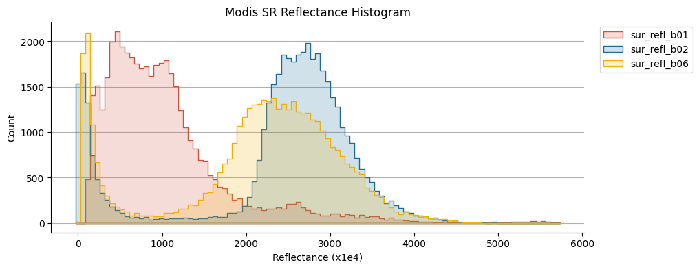
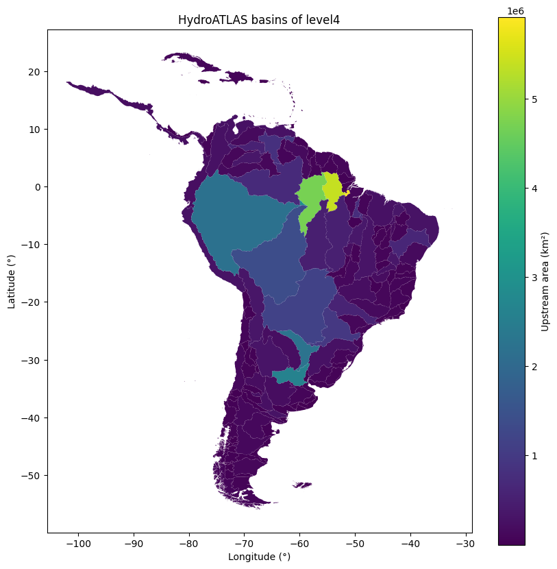

Plotting
========

We embed some plotting capabilities in the library to help you visualize your data. For simplicity we decided to map all the plotting function to the :doc:`matplotlib <matplotlib:index>` library as it's the most used static plotting library in the Python ecosystem.

.. toctree::
   :hidden:
   :maxdepth: 1

   plot-featurecollection
   plot-image
   plot-imagecollection
   map-image
   map-featurecollection

.. grid:: 1 2 3 3

   .. grid-item::

      .. card:: :icon:`fa-solid fa-chart-simple` FeatureCollection
         :link: plot-featurecollection.html

   .. grid-item::

      .. card:: :icon:`fa-solid fa-chart-simple` Image
         :link: plot-image.html

   .. grid-item::

      .. card:: :icon:`fa-solid fa-chart-simple` ImageCollection
         :link: plot-imagecollection.html

   .. grid-item::

      .. card:: :icon:`fa-solid fa-image` Image
         :link: map-image.html

   .. grid-item::

      .. card:: :icon:`fa-solid fa-map` FeatureCollection
         :link: map-featurecollection.html

In all these examples we will use the object interface of matplotlib creating the :py:class:`Figure <matplotlib.figure.Figure>` and :py:class:`Axes <matplotlib.axes.Axes>` object before plotting the data. This is the recommended way to use matplotlib as it gives you more control over the plot and the figure.

.. code-block:: python

   # custom image for this specific chart
   modisSr = (
      ee.ImageCollection("MODIS/061/MOD09A1")
      .filter(ee.Filter.date("2018-06-01", "2018-09-01"))
      .select(["sur_refl_b01", "sur_refl_b02", "sur_refl_b06"])
      .mean()
   )
   histRegion = ee.Geometry.Rectangle([-112.60, 40.60, -111.18, 41.22])

   #create a matplotlib figure
   fig, ax = plt.subplots(figsize=(10, 4))

   # plot the histogram of the reds
   modisSr.geetools.plot_hist(
      bands = ["sur_refl_b01", "sur_refl_b02", "sur_refl_b06"],
      labels = [['Red', 'NIR', 'SWIR']],
      colors = ["#cf513e", "#1d6b99", "#f0af07"],
      ax = ax,
      bins = 100,
      scale = 500,
      region = histRegion,
   )

   # once created the axes can be modified as needed using pure matplotlib functions
   ax.set_title("Modis SR Reflectance Histogram")
   ax.set_xlabel("Reflectance (x1e4)")

If you are used to the :py:mod:`pyplot <matplotlib.pyplot>` interface of matplotlib you can still use it with the state-base module of matplotlib. Just be aware that the module is a stateful interface and you will have less control over the figure and the plot.

.. code-block:: python

   # get all hydroshed from the the south amercias within the WWF/HydroATLAS dataset.
   region = ee.Geometry.BBox(-80, -60, -20, 20);
   fc = ee.FeatureCollection('WWF/HydroATLAS/v1/Basins/level04').filterBounds(region)

   # create the plot
   fc.geetools.plot(property="UP_AREA", cmap="viridis")

   # Customized display
   plt.colorbar(ax.collections[0], label="Upstream area (km²)")
   plt.title("HydroATLAS basins of level4")
   plt.xlabel("Longitude (°)")
   plt.ylabel("Latitude (°)")

